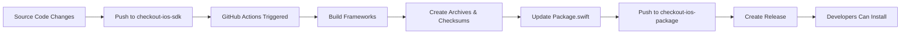

# Setup Guide for Spreedly iOS SDK Distribution

This guide explains how to complete the setup for the private distribution repository after the package files have been moved from the source repository.

## 🔧 Required Configuration

### 1. GitHub Repository Setup

**Update Repository URLs in Package Files:**

You need to replace `your-org` with your actual GitHub organization/username in the following files:

- `Package.swift` (line 38-45): Update the `url` parameters in binary targets
- `Spreedly.podspec` (line 11, 16): Update `homepage` and `source.git` URLs  
- `README.md`: Update all GitHub URLs throughout the document

### 2. GitHub Actions Configuration

**In the source repository (`checkout-ios-sdk`):**

Update the environment variables in `.github/workflows/build-frameworks.yml`:

```yaml
env:
  XCODE_VERSION: '15.4'
  PACKAGE_REPO: 'your-org/checkout-ios-package'  # ← Update this
  PACKAGE_REPO_URL: 'https://github.com/your-org/checkout-ios-package.git'  # ← Update this
```

**Required GitHub Secrets:**

Add this secret to your source repository (`checkout-ios-sdk`):

```
PACKAGE_REPO_TOKEN: <GitHub Personal Access Token>
```

The token needs these permissions for the `checkout-ios-package` repository:
- `Contents: Write` (to push files and create releases)
- `Metadata: Read` (to access repository info)
- `Pull requests: Write` (if you want the action to work with PRs)

### 3. GitHub Personal Access Token Setup

1. Go to GitHub → Settings → Developer settings → Personal access tokens → Tokens (classic)
2. Click "Generate new token (classic)"
3. Give it a descriptive name like "iOS SDK Package Distribution"
4. Select scopes:
   - `repo` (Full control of private repositories)
   - `write:packages` (if you want to publish to GitHub Packages)
5. Copy the token and add it as `PACKAGE_REPO_TOKEN` secret in `checkout-ios-sdk` repository

### 4. Prepare Scripts

**Create the missing script referenced in the workflow:**

Create `.github/scripts/prepare-schemes.sh` in `checkout-ios-sdk`:

```bash
#!/bin/bash

FRAMEWORK_NAME=$1

if [ -z "$FRAMEWORK_NAME" ]; then
    echo "Error: Framework name not provided"
    exit 1
fi

echo "Preparing scheme for $FRAMEWORK_NAME"

# Ensure the scheme is shared
SCHEME_PATH="$FRAMEWORK_NAME/$FRAMEWORK_NAME.xcodeproj/xcshareddata/xcschemes/$FRAMEWORK_NAME.xcscheme"

if [ ! -f "$SCHEME_PATH" ]; then
    echo "Warning: Shared scheme not found at $SCHEME_PATH"
    echo "Please ensure the scheme is marked as 'Shared' in Xcode"
fi

echo "Scheme preparation completed for $FRAMEWORK_NAME"
```

Make it executable:
```bash
chmod +x .github/scripts/prepare-schemes.sh
```

## 🚀 Testing the Setup

### 1. Test the Build Process

1. **Push to source repository** (`checkout-ios-sdk`):
   ```bash
   git add .
   git commit -m "Configure distribution pipeline"
   git push origin main
   ```

2. **Check GitHub Actions** in `checkout-ios-sdk`:
   - Go to Actions tab
   - Verify the workflow runs successfully
   - Check that artifacts are created

3. **Verify Package Repository** (`checkout-ios-package`):
   - Check that frameworks and package files are pushed
   - Verify that a release is created
   - Confirm checksums match

### 2. Test Integration

**Swift Package Manager:**
```swift
// In a test project's Package.swift
.package(url: "https://github.com/your-org/checkout-ios-package.git", from: "1.0.0")
```

**CocoaPods:**
```ruby
# In a test project's Podfile
source 'https://github.com/your-org/checkout-ios-package.git'
pod 'Spreedly', '~> 1.0'
```

## 🔄 Workflow Overview

Here's how the complete process works:



## 📋 Pre-flight Checklist

Before going live, ensure:

- [ ] All `your-org` placeholders are replaced with actual organization name
- [ ] `PACKAGE_REPO_TOKEN` secret is added to source repository
- [ ] Personal access token has correct permissions
- [ ] Package repository (`checkout-ios-package`) exists and is accessible
- [ ] Scripts directory and prepare-schemes.sh exist and are executable
- [ ] Both repositories have appropriate access permissions for your team
- [ ] Test the full pipeline with a sample commit

## 🚨 Important Notes

1. **Repository Access**: Ensure the `checkout-ios-package` repository has appropriate access controls since it's private

2. **Version Management**: The workflow automatically creates version tags, but you may want to customize the versioning strategy

3. **Release Management**: Currently set to create releases on pushes to `main` and version tags. Adjust as needed

4. **Security**: Never commit the GitHub token - always use repository secrets

5. **CocoaPods**: If you plan to use a private CocoaPods spec repository, you'll need additional setup for that

## 🆘 Troubleshooting

**If the workflow fails:**

1. Check the token permissions
2. Verify repository URLs are correct
3. Ensure the package repository exists and is accessible
4. Check that all schemes are marked as "Shared" in Xcode

**If packages don't resolve:**

1. Verify the release was created with the correct assets
2. Check that checksums match
3. Ensure binary target URLs are publicly accessible (even for private repos, release assets are often public)

**Need Help?**

- Check workflow logs in the Actions tab
- Verify all URLs and secrets are correct
- Test with a simple commit to see the full pipeline in action 